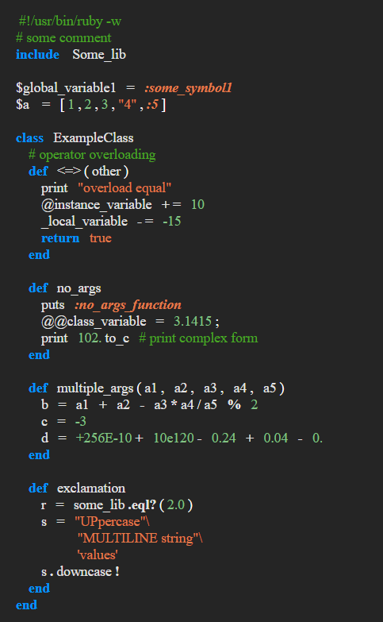

# RubyLexer
Lexer for Ruby programming language

Overview of techniques used to create this lexer can be found in book of 

Aho A.V., Sethi R., Ullman J.D. "Compiler Principles, Techniques and Tools"

## Implemented language highliting features
- identifiers (local, global, class, instance variables; class and function names);
- keywords;
- operators;
- boolean literals and nil; 
- number literals (signed, unsigned integers and doubles; numbers in exponential form);
- symbols and HEREDOC literals;
- string and multiline string literals;
- punctuation;
- error tokens;

Example of lexer results in HTML representation:

## I/O
Input file for lexer is located in <a href="/RubyLexer/input/ruby_test_file.rb">/RubyLexer/input/ruby_test_file.rb</a>

Output file in form of html document can be found in <a href="/RubyLexer/output/index.html">/RubyLexer/output/index.html</a>

